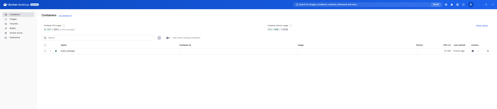

# README

# GitHub Repository Link:

[Link 1](https://github.com/rl329/event_manager/issues/2)
[Link 2](https://github.com/rl329/event_manager/issues/3)
[Link 3](https://github.com/rl329/event_manager/issues/5)
[Link 4](https://github.com/rl329/event_manager/issues/4)
[Link 5](https://github.com/rl329/event_manager/issues/6)

# Dockerhub

## Reflection:

What I learned during this assignment is the length of time and patience it takes when trying to uncover the missing ques needed to have a successful project on all ends. I ran into multiple issues where I either overlooked something (ex: mailtrap) or I didn't know a missing test was needed. I even added additonal testing for coverage that led to 0% change. Username and password validation was crucial for example as shown in the video and provided as an issue, I had issues loggining into the autorize portion before I encountered other issues. My main struggle in this assignment was the debugging and testing skills, I spent numerous hours trying to get the correct issues resolved.

Furthermore, although the assignment was lengthy and had me confused during certain points, I believe it helped understand the real world a little bit more than the average class. I know there is a long road for me to fully feel confident in what I am doing without second guessing myself. This assignment put my skills and knowldge to the test on what the real world has to offer.